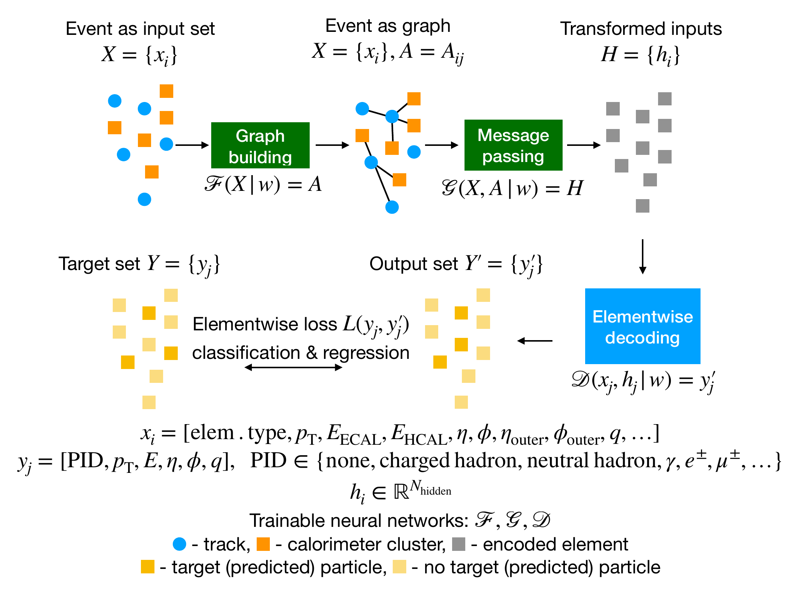

# MLPF plugin for itwinai

[](https://github.com/marketplace/actions/super-linter)
[](https://github.com/marketplace/actions/markdown-link-check)
 [](https://sqaaas.eosc-synergy.eu/#/full-assessment/report/https://raw.githubusercontent.com/eosc-synergy/mlpf-itwinai-plugin.assess.sqaaas/main/.report/assessment_output.json)

## Acknowledgements

MLPF focuses on developing full event reconstruction based on computationally scalable and flexible end-to-end ML models.

This project incorporates code from [particleflow](https://github.com/jpata/particleflow)
by Joosep Pata, Eric Wulff, Farouk Mokhtar, Javier Duarte, Aadi Tepper, Ka Wa Ho, and Lars Sørlie,
which is licensed under the Apache License 2.0. For more details, visit the CHANGELOG.



## How to use this plugin

First of all, install the plugin.

> [!NOTE]
> If you run on an HPC system remember to load the correct modules before.

```bash
pip install "mlpf-itwinai-plugin @ git+https://github.com/matbun/mlpf-itwinai-plugin"
```

Now you can import the MLPF trainer in your code using

```python
from itwinai.plugins.mlpf.trainer import MLPFTrainer

my_trainer = MLPFTrainer(...)
```

Alternatively, you can launch training using the configuration file in this repository:

```bash
python -u pipeline.py \
    --train \
    --ray-train \
    --config parameters/pyg-clic-itwinai.yaml \
    --data-dir /ceph/hpc/data/d2024d11-083-users/data/tensorflow_datasets/clic \
    --ntrain 50 \
    --nvalid 50 \
    --prefix foo_prefix \
    --ray-cpus 8 \
    --gpus 1 \
    --gpu-batch-multiplier 8 \
    --num-workers 8 \
    --prefetch-factor 8 \
    --experiments-dir $PWD/experiments \
    --slurm-nnodes 1 \
    --num-epochs 2
```

You will find more examples under `scripts/jsc/interactive.sh` and `scripts/vega/interactive.sh`

<!-- > [!NOTE]
> Consider that this model needs to be distributed on 4 GPUs, as it implements
> model-parallel distributed training. It can scale to multiple nodes and
> the SLURM jobs cript `slurm.jsc.sh` provides an example on how to launch
> distributed training on HPC. You can adjust the number of nodes in that file. -->

## Docker containers

This repository provides two examples of Dockerfiles, one for JupyterLab
images and the other for simple Docker containers. Both Dockerfiles
are based on the itwinai container image, which already provides most
of the dependencies.
